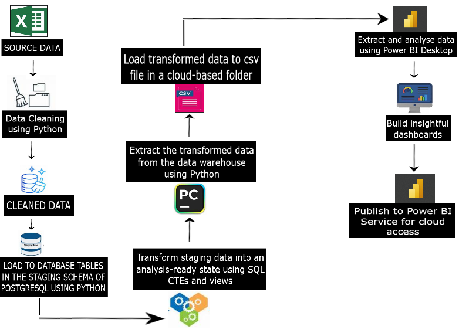

# Quarterly Homelessness Trends: Hackney vs Neighbouring Local Authorities
This data analysis project involved creating an automated ETL pipeline to extract source data from multiple files in cloud storage, transform it, and load the refined data to support a real-time Power BI dashboard with insightful report.
### DATA
Dataset is publicly available.

### TOOLS USED
1. PyCharm IDE: Used for creating and running Python scripts.
2. PostgreSQL & PgAdmin4: Used for writing and executing SQL queries.
3. Power BI & Power Query: Used for building automated dashboards using DAX and M language.
4. OneDrive & OneLake: Used for secure, cloud-based data storage and access.
5. PowerPoint: Used to deliver the presentation

### PROJECT PROCESS OVERVIEW

Full version of this report is available [here](https://github.com/Beegie01/Comparing-Homelessness-Trends-in-Hackney-and-Neighbouring-Local-Authorities/blob/main/Hackney%20Quarterly%20Report%20-%20MAR2025.pdf). 

### HOUSEHOLDS AND INITIAL ASSESSMENT
View a snapshot of the dashboard [here](https://github.com/Beegie01/Comparing-Homelessness-Trends-in-Hackney-and-Neighbouring-Local-Authorities/blob/main/initial_assessment_report.pdf)

### OWED PREVENTION DUTY
View a snapshot of the dashboard [here](https://github.com/Beegie01/Comparing-Homelessness-Trends-in-Hackney-and-Neighbouring-Local-Authorities/blob/main/prevention_duty_report.pdf)

### PREVENTION DUTY ENDED
View a snapshot of the dashboard [here](https://github.com/Beegie01/Comparing-Homelessness-Trends-in-Hackney-and-Neighbouring-Local-Authorities/blob/main/prevention_duty_ending_report.pdf)

### OWED RELIEF DUTY
View a snapshot of the dashboard [here](https://github.com/Beegie01/Comparing-Homelessness-Trends-in-Hackney-and-Neighbouring-Local-Authorities/blob/main/relief_duty_report.pdf)

### RELIEF DUTY ENDED
View a snapshot of the dashboard [here](https://github.com/Beegie01/Comparing-Homelessness-Trends-in-Hackney-and-Neighbouring-Local-Authorities/blob/main/relief_duty_ending_report.pdf)

### HOUSEHOLDS IN TEMPORARY ACCOMMODATION
View a snapshot of the dashboard [here](https://github.com/Beegie01/Comparing-Homelessness-Trends-in-Hackney-and-Neighbouring-Local-Authorities/blob/main/temp_accommodation_report.pdf)

### TEMPORARY ACCOMMODATION HOUSEHOLD COMPOSITION
View a snapshot of the dashboard [here](https://github.com/Beegie01/Comparing-Homelessness-Trends-in-Hackney-and-Neighbouring-Local-Authorities/blob/main/temp_accommodation_households_report.pdf)

### RECOMMENDATIONS 
1. Educate households on importance of encouraging friends or family members to apply early for their own housing options while relationships are still positive.
2. Encourage household members to report early signs of domestic abuse to help identify potential risks of homelessness and enable timely preventive measures.
3. Strengthen the council’s capacity to secure accommodation and expand its use of LA/HA stock to reduce reliance on more expensive alternatives.
4. Direct greater investment towards reducing the length of time families spend in temporary accommodation, in order to minimize the negative impact on growing children.
5. Investigate the root causes of unexpectedly high use of temporary accommodation by  single adult males.
